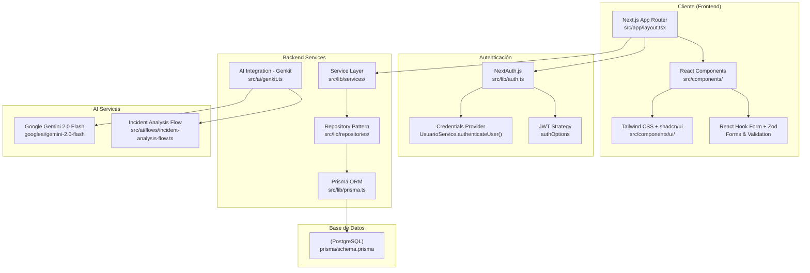
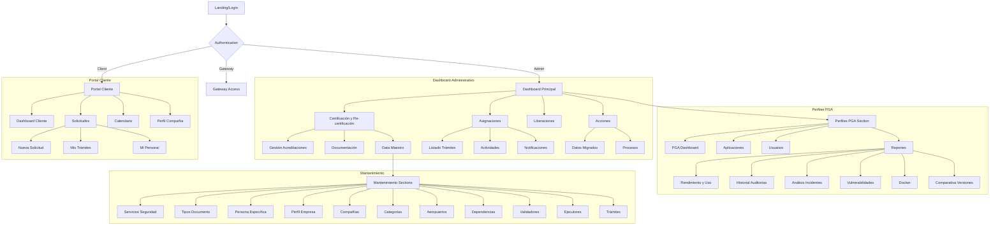
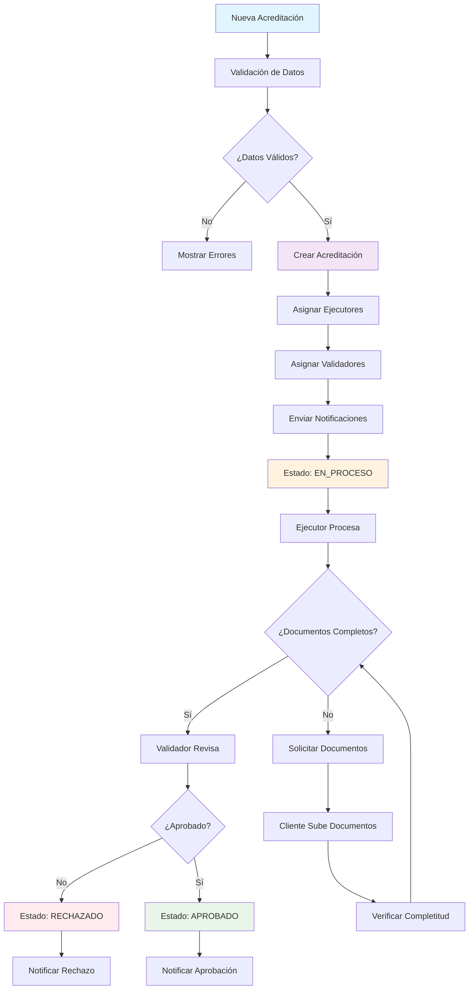
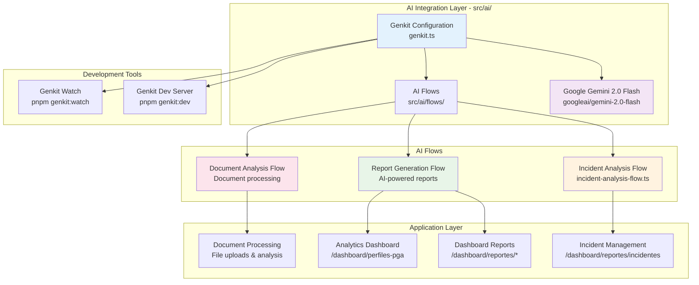
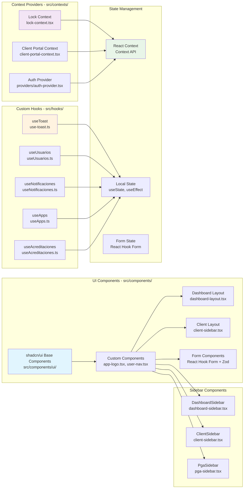
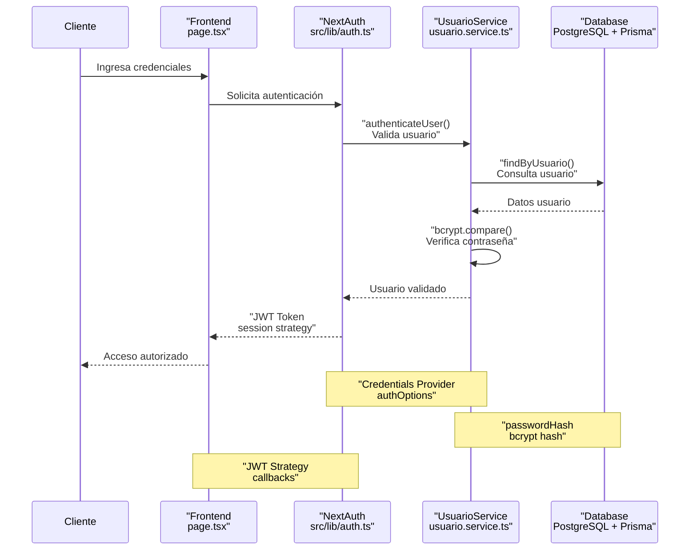
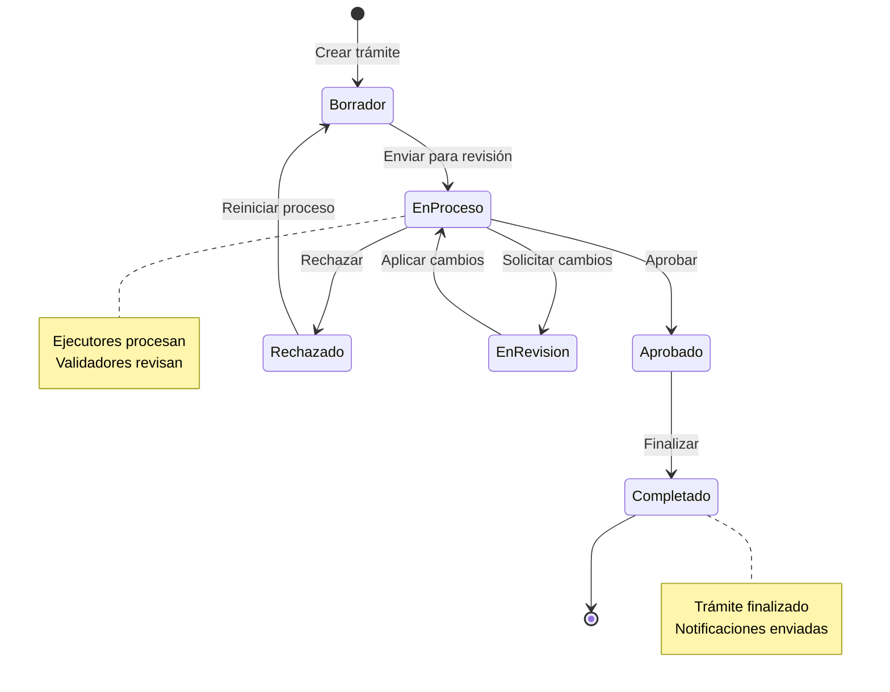
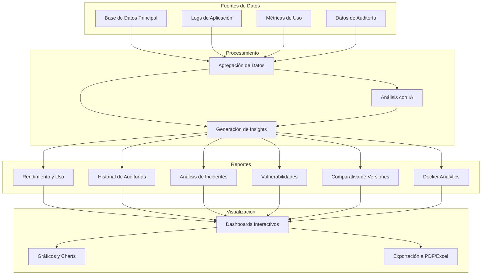

# Documentación de Arquitectura del Sistema PGA

## Portal de Gestión Aeroportuaria (PGA)

### Información General
- **Framework**: Next.js 15.3.3 con App Router
- **Styling**: Tailwind CSS con shadcn/ui
- **AI Integration**: Google Genkit con Gemini 2.0 Flash
- **Backend**: Firebase (Auth, Firestore, Functions, Hosting)
- **Database**: PostgreSQL con Prisma ORM
- **Forms**: React Hook Form con Zod validation

---

## 1. Arquitectura de la Aplicación



---

## 2. Estructura de Navegación y Pantallas



---

## 3. Servicios y APIs

```mermaid
graph TB
    subgraph "Service Layer - src/lib/services/"
        A["UsuarioService<br/>usuario.service.ts"]
        B["AcreditacionService<br/>acreditacion.service.ts"]
        C["NotificacionService<br/>notificacion.service.ts"]
        D["TramiteService<br/>tramite.service.ts"]
        E["AppService<br/>app.service.ts"]
        F["CompaniaService<br/>compania.service.ts"]
        G["ValidadorService<br/>validador.service.ts"]
        H["EjecutorService<br/>ejecutor.service.ts"]
        I["DependenciaService<br/>dependencia.service.ts"]
        J["CategoriaService<br/>categoria.service.ts"]
        K["AeropuertoService<br/>aeropuerto.service.ts"]
        L["TipoDocumentoService<br/>tipo-documento.service.ts"]
        M["EquipoSeguridadService<br/>equipoSeguridad.service.ts"]
    end

    subgraph "Repository Layer - src/lib/repositories/"
        N["UsuarioRepository<br/>usuario.repository.ts"]
        O["AcreditacionRepository<br/>acreditacion.repository.ts"]
        P["NotificacionRepository<br/>notificacion.repository.ts"]
        Q["TramiteRepository<br/>tramite.repository.ts"]
        R["AppRepository<br/>app.repository.ts"]
        S["CompaniaRepository<br/>compania.repository.ts"]
        T["ValidadorRepository<br/>validador.repository.ts"]
        U["EjecutorRepository<br/>ejecutor.repository.ts"]
        V["DependenciaRepository<br/>dependencia.repository.ts"]
        W["CategoriaRepository<br/>categoria.repository.ts"]
        X["AeropuertoRepository<br/>aeropuerto.repository.ts"]
        Y["TipoDocumentoRepository<br/>tipo-documento.repository.ts"]
        Z["EquipoSeguridadRepository<br/>equipo-seguridad.repository.ts"]
        AA["BaseRepository<br/>base.repository.ts"]
    end

    subgraph "External Services"
        BB["NextAuth Authentication<br/>src/lib/auth.ts"]
        CC["Google Genkit AI<br/>src/ai/genkit.ts"]
        DD["Firebase Services<br/>Environment Config"]
        EE["PostgreSQL Database<br/>Prisma Client"]
    end

    A --> N
    B --> O
    C --> P
    D --> Q
    E --> R
    F --> S
    G --> T
    H --> U
    I --> V
    J --> W
    K --> X
    L --> Y
    M --> Z

    N --> AA
    O --> AA
    P --> AA
    Q --> AA
    R --> AA
    S --> AA
    T --> AA
    U --> AA
    V --> AA
    W --> AA
    X --> AA
    Y --> AA
    Z --> AA

    AA --> EE
    A --> BB
    CC --> DD
```



---

## 4. Modelo de Datos y Entidades

```mermaid
erDiagram
    Usuario {
        int id PK
        string nombre
        string usuario UK
        string correo UK
        string telefono
        boolean activo
        string rango
        string departamento
        enum nivelPerfil
        string passwordHash
        datetime createdAt
        datetime updatedAt
    }

    App {
        string id PK
        string nombre
        text descripcion
        boolean activa
        string version
        datetime lastUpdate
        datetime lastAudit
        int auditorId FK
        string clientId UK
        string code UK
        string urlDestino
        string redirectUrl
        int assignedDevId FK
        int backendDevId FK
        int frontendDevId FK
        int users72h
        int totalUsers
        datetime createdAt
        datetime updatedAt
    }

    DetalleTecnico {
        int id PK
        string appId FK UK
        string stack
        string architecture
        string database
        string cicd
        string repository
        datetime createdAt
        datetime updatedAt
    }

    UsuarioApp {
        int id PK
        int usuarioId FK
        string appId FK
        datetime fechaConcesion
        boolean activa
    }

    AccesoApp {
        int id PK
        int usuarioId FK
        string appId FK
        datetime fecha
        string userAgent
        string ip
    }

    Incidente {
        int id PK
        string appId FK
        string titulo
        text descripcion
        enum severidad
        boolean resuelto
        datetime fechaCreacion
        datetime fechaResolucion
        text solucion
    }

    Notificacion {
        int id PK
        int usuarioId FK
        string titulo
        text mensaje
        enum tipo
        boolean leida
        datetime fechaCreacion
    }

    Acreditacion {
        string id PK
        string numero UK
        string solicitante
        string personal
        string aeropuertoId FK
        string categoria
        string proceso
        string subproceso
        enum estado
        int progreso
        string referencia
        datetime fechaIngreso
        datetime fechaVencimiento
        text observaciones
        boolean hasWarning
        decimal costoUSD
        datetime createdAt
        datetime updatedAt
    }

    Tramite {
        string id PK
        string titulo
        text descripcion
        enum estado
        int creadorId FK
        datetime fechaCreacion
        datetime fechaLimite
        int prioridad
        text observaciones
        datetime createdAt
        datetime updatedAt
    }

    Aeropuerto {
        string id PK
        string codigo UK
        string nombre
        string pais
        string ciudad
        boolean activo
        datetime createdAt
        datetime updatedAt
    }

    Compania {
        string id PK
        string nombre
        string ruc UK
        string razonSocial
        enum estado
        datetime createdAt
        datetime updatedAt
    }

    Usuario ||--o{ UsuarioApp : "tiene"
    Usuario ||--o{ AccesoApp : "realiza"
    Usuario ||--o{ Notificacion : "recibe"
    Usuario ||--o{ Tramite : "crea"
    Usuario ||--o{ App : "audita"
    Usuario ||--o{ App : "desarrolla_asignado"
    Usuario ||--o{ App : "desarrolla_backend"
    Usuario ||--o{ App : "desarrolla_frontend"

    App ||--|| DetalleTecnico : "tiene"
    App ||--o{ UsuarioApp : "concedida_a"
    App ||--o{ AccesoApp : "accedida_por"
    App ||--o{ Incidente : "tiene"

    Aeropuerto ||--o{ Acreditacion : "ubicacion"
```

---

## 5. Flujo de Datos de Acreditaciones



---

## 6. Integración de Inteligencia Artificial



---

## 7. Componentes Principales del Sistema



---

## 8. Seguridad y Autenticación



---

## 9. Flujo de Trabajo de Trámites



---

## 10. Arquitectura de Reportes



---

## Resumen de la Arquitectura

Este sistema PGA (Portal de Gestión Aeroportuaria) implementa una arquitectura moderna y escalable basada en:

### Tecnologías Clave
- **Frontend**: Next.js 15 con App Router, React, Tailwind CSS
- **Backend**: Prisma ORM, PostgreSQL, NextAuth.js
- **AI**: Google Genkit con Gemini 2.0 Flash
- **UI**: shadcn/ui components, React Hook Form

### Características Principales
- **Arquitectura en Capas**: Service Layer, Repository Pattern, Base Repository
- **Autenticación Segura**: JWT con NextAuth.js, hash de contraseñas con bcrypt
- **Dos Portales**: Dashboard administrativo y Portal cliente
- **Gestión Completa**: Acreditaciones, trámites, usuarios, reportes
- **IA Integrada**: Análisis de incidentes y generación de reportes
- **Diseño Responsive**: Componentes reutilizables y accesibles

### Flujos de Trabajo
- **Acreditaciones**: Desde solicitud hasta aprobación/rechazo
- **Trámites**: Estados definidos con validaciones
- **Reportes**: Análisis automatizado con IA
- **Mantenimiento**: Gestión de datos maestros

Esta documentación proporciona una visión completa de la arquitectura del sistema, sus componentes, relaciones y flujos de trabajo principales.